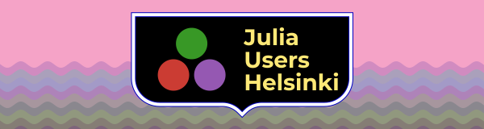

# Julia Users Group in Helsinki

Repository for the homepage of the [Julia Users Group in Helsinki area](https://julia-users-helsinki.github.io)

## Get involved

We aim at organizing regular meetups and activities for the Julia enthusiasts in the Helsinki area. If interested, get in touch by opening issues/pull requests or by writing a message in `helsinki-local` in the Julia slack.

## Credits

Thanks to [cormullion](https://github.com/cormullion) for designing the logo.

